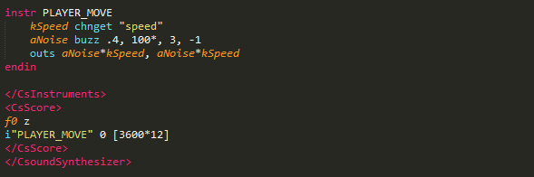

# Controlling Csound from Unity 

Once you have attached a Csound file to a CsoundUnity component, you may wish to control aspects of that instrument in realtime. 
Before calling any CsoundUnity methods, one must first access the component using the **GetComponent()** method. This can be seen the simple script that follows. One usually calls GetComponent() in your script's **Awake()** or **Start()** methods. You can also wait for Csound to be initialised before executing your code. Once the CsoundUnity component has been accessed, any of its member methods can be called. 

See some examples below:

```cs
CsoundUnity csound;

void Start()
{
	csound = GetComponent<CsoundUnity>();        
}

void Update()
{
	if (!csound.IsInitialized) return;
	// your code
}
```

```cs
CsoundUnity csound;

IEnumerator Start()
{
	csound = GetComponent<CsoundUnity>();
	while (!csound.IsInitialized)
	{
		yield return null;
	}
	
	// your code
}

// Update is called once per frame
void Update()
{
	// your code
}
```

```cs
CsoundUnity csound;
private bool initialized;

private void Start()
{
	csound = GetComponent<CsoundUnity>();
	csound.OnCsoundInitialized += Csound_OnCsoundInitialized;
}

private void Csound_OnCsoundInitialized()
{
	initialized = true;
	Debug.Log("Csound initialised!");
}

// Update is called once per frame
void Update()
{
	if (!initialized) return;

	// your code
}
```


**Csound's channel system**
 
 Csound allows data to be sent and received over its channel system. To access data in Csound, one must use the **chnget** opcode. In the following code example, we access data being sent from Unity to Csoud on a channel named *speed*. The variable kSpeed will constantly update according to the value stored on the channel named *speed*. 



In order to send data from Unity to Csound we must use the [**CsoundUnity.SetChannel(string channel, double value)**](https://github.com/rorywalsh/CsoundUnity/blob/c288e9054c39f8bb0e200f6a67338f6d2dbc6837/Runtime/CsoundUnity.cs#L750) method. 
See the **Update()** method of the script below:


Other examples:
```cs
// C# code
if (csoundUnity)
	csoundUnity.SetChannel("BPM", BPM);
```

```c
;csd file
kBPM = abs(chnget:k("BPM"))
```