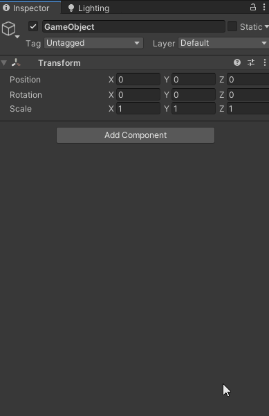
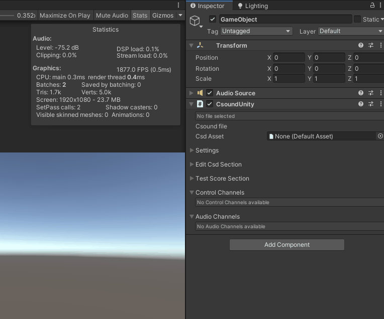

## Getting Started ##

CsoundUnity is a component that can be added to any GameObject in a scene. Press the **Add Component** button in Unity's inspector, search for **CsoundUnity**, and select the **CsoundUnity** component. An **Audio Source** component is added automatically if one does not already exist.



Once the component has been added, drag a `.csd` file from your project assets into the **Csd Asset** field. When Play mode starts, Csound compiles the file and begins sending audio to the Audio Source — integrating seamlessly with Unity's spatial audio, mixer, and effects pipeline.



---

### Namespace ###

All CsoundUnity types live in the `Csound.Unity` namespace. Add the following using directive to any script that references CsoundUnity:

```csharp
using Csound.Unity;
```

---

### Waiting for initialisation ###

Csound compiles and starts asynchronously. Always check `IsInitialized` before calling channel or score methods:

```csharp
using Csound.Unity;
using UnityEngine;

public class MyAudioController : MonoBehaviour
{
    private CsoundUnity _csound;

    void Start()
    {
        _csound = GetComponent<CsoundUnity>();
    }

    void Update()
    {
        if (!_csound.IsInitialized) return;
        _csound.SetChannel("gain", 0.5);
    }
}
```

Alternatively, subscribe to the `OnCsoundInitialized` event — see [Lifecycle API](lifecycle.md) for the full set of initialisation patterns.

---

### What's in v4.0.0 ###

| Feature | Doc |
|---|---|
| Csound 7 on all platforms | [Supported Platforms](platforms.md) |
| IAudioGenerator audio path (Unity 6+) | [IAudioGenerator](iaudiogenerator.md) |
| Native low-latency audio input (macOS, iOS, Android, Windows) | [Native Audio Input](native_audio_input.md) |
| MIDI input (CoreMIDI, AAudio MIDI, WinMM) | [MIDI Input](midi.md) |
| UI components (Slider, Button, Toggle, XYPad, Keyboard, Meter, …) | [UI Components](ui_components.md) |
| Audio Input Routing and the Route Graph editor | [Audio Input Routing](audio_input_routing.md) |
| Timeline integration (score events, channel automation) | [Timelines](timelines.md) |
| Lifecycle API (Initialize, Stop, Restart) | [Lifecycle API](lifecycle.md) |
| Presets (save / recall channel values as JSON) | [Presets](presets.md) |
