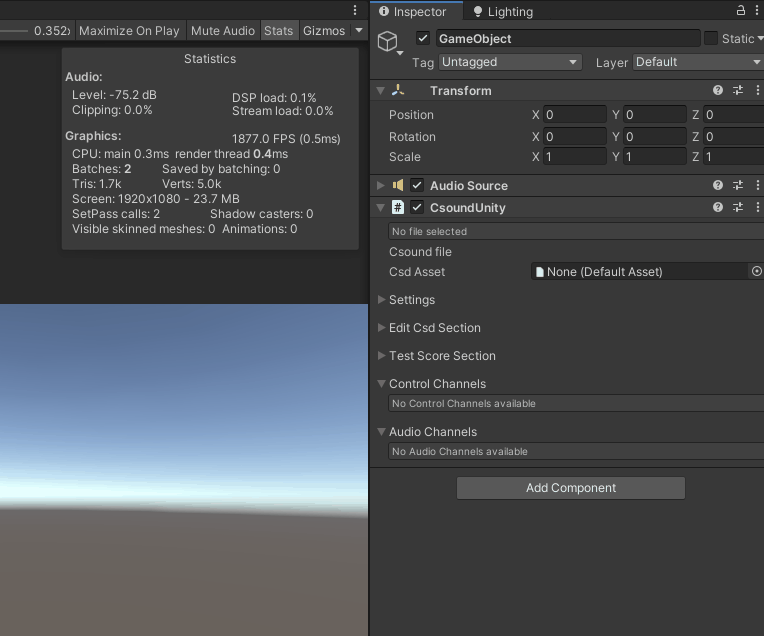
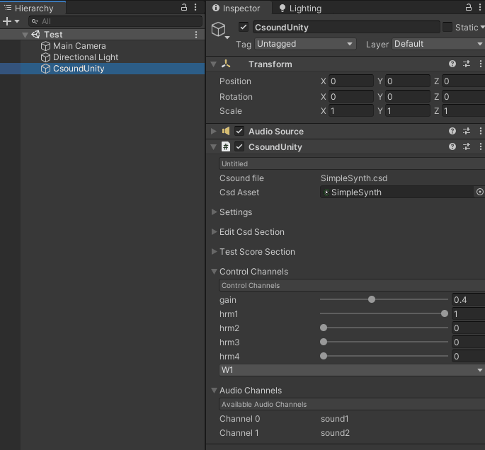

### Documentation v3.0

-   [Installing](#installing)
-   [Getting started](#getting_started)
-   [Controlling Csound from Unity](#controlling_csound_from_unity)
-   [Controlling Csound from the Unity Editor](#controlling_csound_from_unity_editor)
-   [CsoundUnityChild](#csoundunity_child)
-   [CsoundFileWatcher](#csound_filewatcher)
-	[Supported Platforms](#platforms)


<a name="installing"></a>
## Installing

**From version 3.0 CsoundUnity is in the form of a Unity Package**. See the [Unity Manual](https://docs.unity3d.com/Manual/PackagesList.html) for more information.  

You should use the **Unity Package Manager** to install the CsoundUnity package.  
To open the Package Manager in Unity, select **Window/PackageManager** from the top menu.

**If you have git installed**: press +, *Add package from git url...*, paste this url https://github.com/rorywalsh/CsoundUnity.git#develop, and press Add.

**If you don’t have git**: 
- option 1: clone https://github.com/rorywalsh/CsoundUnity.git#develop or download the [Source Code.zip](https://github.com/rorywalsh/CsoundUnity/archive/refs/tags/v3.0.zip) on your local disk, extract its content, press + in the Package Manager, *Add package from disk...*, and select the package.json inside the extracted folder.  
- option 2: download the [Source Code tar.gz](https://github.com/rorywalsh/CsoundUnity/archive/refs/tags/v3.0.tar.gz) from the release page, press + in the Package Manager,  *Add package from tarball...*, and select the downloaded tar.gz.


<a name="getting_started"></a>
## Getting Started

CsoundUnity is a simple component that can be added to any GameObject in a scene. To do so simple hit **AddComponent** in the inspector, then click **Audio** and add **CsoundUnity**.


CsoundUnity requires the presence of an AudioSource. If the GameObject you are trying to attach a CsoundUnity component to does not already have an AudioSource attached, one will be added automatically. 

Once a CsoundUnity component has been added to a GameObject, you will need to attach a Csound file to it. Csound files can be placed anywhere inside the Assets folder. To attach a Csound file to a CsoundUnity component, simply drag it from the Assets folder to the 'Csd Asset' field in the CsoundUnity component inspector. When your game starts, Csound will feed audio from its output buffer into the AudioSource. Any audio produced by Csound can be accessed through the AudioSource component. This is currently restricted to stereo files, but will work for any amount of channels. See [**CsoundUnity.ProcessBlock()**](https://github.com/rorywalsh/CsoundUnity/blob/c288e9054c39f8bb0e200f6a67338f6d2dbc6837/Runtime/CsoundUnity.cs#L1414) 




You can start an instrument to play at any time using the [**CsoundUnity.SendScoreEvent()**](https://github.com/rorywalsh/CsoundUnity/blob/c288e9054c39f8bb0e200f6a67338f6d2dbc6837/Runtime/CsoundUnity.cs#L431) method. 


<a name=controlling_csound_from_unity></a>
## Controlling Csound from Unity 

Once you have attached a Csound file to a CsoundUnity component, you may wish to control aspects of that instrument in realtime. 
Before calling any CsoundUnity methods, one must first access the component using the **GetComponent()** method. This can be seen the simple script that follows. One usually calls GetComponent() in your script's **Awake()** or **Start()** methods. You can also wait for Csound to be initialised before executing your code. Once the CsoundUnity component has been accessed, any of its member methods can be called. 

See some examples below:

```cs
CsoundUnity csound;

void Start()
{
	csound = GetComponent<CsoundUnity>();        
}

void Update()
{
	if (!csound.IsInitialized) return;
	// your code
}
```

```cs
CsoundUnity csound;

IEnumerator Start()
{
	csound = GetComponent<CsoundUnity>();
	while (!csound.IsInitialized)
	{
		yield return null;
	}
	
	// your code
}

// Update is called once per frame
void Update()
{
	// your code
}
```

```cs
CsoundUnity csound;
private bool initialized;

private void Start()
{
	csound = GetComponent<CsoundUnity>();
	csound.OnCsoundInitialized += Csound_OnCsoundInitialized;
}

private void Csound_OnCsoundInitialized()
{
	initialized = true;
	Debug.Log("Csound initialised!");
}

// Update is called once per frame
void Update()
{
	if (!initialized) return;

	// your code
}
```


**Csound's channel system**
 
 Csound allows data to be sent and received over its channel system. To access data in Csound, one must use the **chnget** opcode. In the following code example, we access data being sent from Unity to Csoud on a channel named *speed*. The variable kSpeed will constantly update according to the value stored on the channel named *speed*. 


In order to send data from Unity to Csound we must use the [**CsoundUnity.SetChannel(string channel, double value)**](https://github.com/rorywalsh/CsoundUnity/blob/c288e9054c39f8bb0e200f6a67338f6d2dbc6837/Runtime/CsoundUnity.cs#L750) method. 
See the **Update()** method of the script below:


Other examples:
```cs
// C# code
if (csoundUnity)
	csoundUnity.SetChannel("BPM", BPM);
```

```c
;csd file
kBPM = abs(chnget:k("BPM"))
```


<a name=controlling_csound_from_unity_editor></a>
## Controlling Csound from the Unity Editor

In order to control Csound instruments in standalone gameplay, you will need to use the methods described above. However, you can also control Csound channels using the Unity Editor while you are developing your game's sounds. To do so, you must provide a short <Cabbage></Cabbage> descriptor at the top of your Csound files describing the channels that are needed. This simple descriptor section uses a single line of code to describe each channel. Each line starts with the given channel's controller type and is then followed by combination of other identifiers such as channel(), text(), and range(). The following descriptor sets up 3 channel controllers. A slider, a button and a checkbox(toggle).
```c
<Cabbage>
form caption("SimpleFreq")
hslider channel("freq1"), text("Frequency Slider"), range(0, 10000, 0)
button channel("trigger"), text("Push me")
checkbox channel("mute")
</Cabbage>
```

Each control MUST specify a channel. The range() identifier must be used if the controller type is a slider. The text() identifier can be used to display unique text beside a control but it is not required. If it is left out, the channel() name will be used as the control's label. The caption() identifier, used with form, is used to display some simple help text to the user.

See [Cabbage Widgets](https://cabbageaudio.com/docs/cabbage_syntax/) for more information about the syntax to use.
CsoundUnity aims to support most of the (relevant) Widgets available in Cabbage.

When a Csound file which contains a valid <Cabbage> section is dragged to a CsoundUnity component, Unity will generate controls for each channel. These controls can be tweaked when your game is running. Each time a control is modified, its value is sent to Csound from Unity on the associated channel. In this way it works the same as the method above, only we don't have to code anything in order to test our sound. For now, CsoundUnity support only four types of controller, slider, checkbox(toggle), button and comboboxes. 


<a name=csoundunity_child></a>
## CsoundUnityChild

New in version 3.0, the CsoundUnityChild component lets you read the AudioChannels found in a CsoundUnity instance. You can have as many audio channels you want in your Csd.
You can set them with the chnset opcode.
See the example below:
```csound
<Cabbage>
form caption("Test CsoundUnityChild") 
rslider channel("gain"), range(0, 1, .4, 1, .01), text("Gain")
rslider range(0, 1, 1, 1, 0.001), channel("hrm1")
rslider range(0, 1, 0, 1, 0.001), channel("hrm2")
rslider range(0, 1, 0, 1, 0.001), channel("hrm3")
rslider range(0, 1, 0, 1, 0.001), channel("hrm4")
</Cabbage>
<CsoundSynthesizer>
<CsOptions>
-n -d 
</CsOptions>
<CsInstruments>
; Initialize the global variables. 
ksmps = 32
nchnls = 2
0dbfs = 1

giWave1 ftgen 1, 0, 4096, 10, 1
giWave2 ftgen 1, 0, 4096, 10, 1, .5, .25, .17

;this instrument sends audio to two named channels
;this audio can be picked up by any CsoundUnityNode component..
instr ChildSounds
    a1 oscili 1, 440, giWave1
    chnset a1, "sound1"
    a2 oscili 1, 840, giWave1
    chnset a2, "sound2"
endin

</CsInstruments>
<CsScore>
;causes Csound to run for about 7000 years...
f0 z
i"ChildSounds" 0 z
</CsScore>
</CsoundSynthesizer>
```

To be able to pick those named channels, create a GameObject and add the CsoundUnityChild component. An AudioSource will be added if there is none.
There you can choose the AudioChannels that this CsoundUnityChild will play and in which configuration.
If AudioChannelsSetting is set to MONO, the selected AudioChannel will be played in both LEFT and RIGHT channel, at half volume, to have it perfectly centered.
If AudioChannelsSetting is set to STEREO, the selected AudioChannels will use the respective output channel.



<a name=csound_filewatcher></a>
## CsoundFileWatcher

From version 3.0 CsoundUnity can detect the changes made to the *csd* file while modifying it in an external editor. For this to work add **FILEWATCHER_ON** in your project Scripting Define Symbols. **This is an experimental feature**: please report any issue [on Github](https://github.com/rorywalsh/CsoundUnity/issues).

<a name=platforms></a>
## Supported Platforms

CsoundUnity supports building for Windows, macOS and Android 64bit (it has successfully been tested on Oculus Quest). The aim of CsoundUnity is to support other platforms in the future, starting from iOS and WebGL.