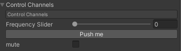

## Controlling Csound from the Unity Editor

Once you have loaded a csound file into your CsoundUnity component, you are able to control parameters of your Csound code using GUI widgets generated in the inspector. 

Each of these graphical components coorisponds with a Csound channel that can be used in the csound orchestra section to control various parameters of your sound. To reveal a channel in the editor, you must write [**Cabbage widget**](https://cabbageaudio.com/docs/cabbage_syntax/) code between ```<Cabbage> </Cabbage>``` xml tags at the top of your **Csound** files (.csd).



```csound
<Cabbage>
form caption("SimpleFreq")
hslider channel("freq1"), text("Frequency Slider"), range(0, 10000, 0)
button channel("trigger"), text("Push me")
checkbox channel("mute")
</Cabbage>
```


The block above is an example of a Cabbage GUI section that will create graphical elements for 3 channels: a slider, a button and a checkbox(toggle). Notice that each graphical element should be on its own line and that starts with the controller type followed by  other identifiers which describe attributes of the graphical element such as *channel()*, *text()*, and *range()*.  

* Each control MUST specify a channel using the **channel()** identifier.  
* The **range()** identifier must be used if the controller type is a slider.  
* The **text()** identifier displays a label beside a control and can be useful to give a control context to a user. If no **text()** is provided, the **channel()** name will be used as the control's label. 
* The **caption()** identifier can be used in with the *form* element and is used to display some simple help text to the user.


**CsoundUnity** supports these widgets from **Cabbage**:

* rslider|hslider|vslider: horizontal sliders
* button: button with text
* checkbox: toggle box
* combobox: dropdown menu 

See [**Cabbage Widgets**](https://cabbageaudio.com/docs/cabbage_syntax/) for more information about the syntax to use.

___

Csound Unity is based off of the [**Cabbage**](https://cabbageaudio.com/) framework which allows for the creation of VST/AU plugins based on **Csound**. In addition to creating plugins, **Cabbage** is also a wonderful development environment for generating csound files to be used in **CsoundUnity**.  
**Cabbage** also contains many excellent examples, be aware that most are not currently supported in **CsoundUnity**, due to limited widget support. It may be possible to adapt many of the examples to work with **CsoundUnity** so please ask the [**Cabbage Forum**](https://forum.cabbageaudio.com/) for any Cabbage example that you would like to be added to the **CsoundUnity** code library.