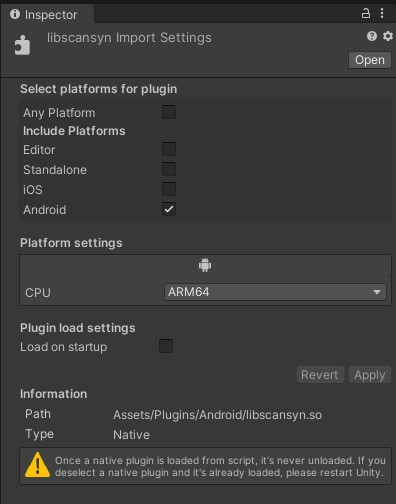

## Environment Variables

New in **CsoundUnity** 3.2.0, it is now possible to set the **Csound** *Environment Variables* independently for each **CsoundUnity** instance in your scene.  
You can use the *Environment Variables* to set the directories where **Csound** will look for specific files.  
Those files include *audio* files (in any format supported by **Csound**), *sound font* files, *htrf* files, but also plugins and other formats.  
See the [Csound Environment Variables Page](https://csound.com/docs/manual/CommandEnvironment.html) from the **Csound** manual for more information.  

You can add as many Environment Variables as you want. Be aware that a duplicated setting (same Platform and same Type) will cause the second setting in the list to be picked.  

In the following image, we are setting the *SFDIR* folder for all the supported platforms to the *Application.PersistentDataPath*, inside a *CsoundFiles* folder:
 

Those Environment variables will be set **BEFORE** the **CsoundUnity** instance starts.
Be sure to copy the needed files in a directory where **CsoundUnity** will have access to.  
For example, on the **Android** platform, remember that the *StreamingAssets* folder must be accessed with a *WebRequest*, and this is not done automatically by **CsoundUnity**, so **Csound** won't find the files placed there, also if you set the folder correctly.  
Instead, on the **Android** platform, **you should always place your files in the** ***Application.PersistentData*** **folder**.
When you use the *PersistentData* folder, you will need a way to copy the files there.  
Look at the [EnvironmentVars](https://github.com/rorywalsh/CsoundUnity/tree/master/Samples~/EnvironmentVars) samples in the **CsoundUnity** package for how to do it.

For the platforms other than **Android** you can safely use the *StreamingAssets* folder.

You can preview the paths that will be used at runtime for each platform selecting the "Runtime paths" toggle. This setting won't have any active effect, but this info can be helpful during development.  
When this toggle is not selected you will be able to open the folder related to your development platform just by clicking the shown path.  
The environment settings have copy-paste support.

### Loading Csound plugins

For desktop applications you can safely use the *OPCODE6DIR64* folder setting to load plugins, placing **Csound** plugins basically anywhere the editor/built application can find them.
Be sure to copy the plugins there before **CsoundUnity** starts.

On the **Android** platform this setting will not work, because native libraries are meant to be placed in a "lib" folder (aka [**Android NativeLibraryDir**](https://developer.android.com/reference/android/content/pm/ApplicationInfo#nativeLibraryDir)) in the built apk to be loaded.  
When building for **Android**, **Unity** copies its libraries and all the plugins found in the project that have been set for the **Android** target platform (and the selected CPU) in that *lib* folder inside the apk.

To be able to use **Csound** plugins on **Android**, from version 3.4.0 a special base folder has been added to the Environment settings, called *Plugins*.

If this is set, once the app is built it will try to load **Csound** plugins from the **Android NativeLibraryDir**.  

For this to work simply copy the **Csound Android** plugins you wish to use anywhere in the **Unity** project, but be sure to set the right platform for them:  

Add the plugins for each CPU you want to support.  

Also be sure to set the *OPCODE6DIR64* to *Plugins*, so that CsoundUnity will try to load them.
The Suffix folder will be ignored.
  
You can still set the *SFDIR* in another location to load sound files or any additional files, like in the example below:
