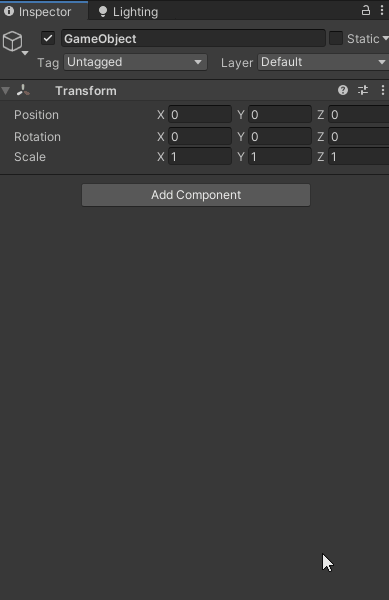

# Getting Started

CsoundUnity is a simple component that can be added to any GameObject in a scene. To do so simple hit **AddComponent** in the inspector, then click **Audio** and add **CsoundUnity**.

CsoundUnity requires the presence of an AudioSource. If the GameObject you are trying to attach a CsoundUnity component to does not already have an AudioSource attached, one will be added automatically. 

Once a CsoundUnity component has been added to a GameObject, you will need to attach a Csound file to it. Csound files can be placed anywhere inside the Assets folder. To attach a Csound file to a CsoundUnity component, simply drag it from the Assets folder to the 'Csd Asset' field in the CsoundUnity component inspector. When your game starts, Csound will feed audio from its output buffer into the AudioSource. Any audio produced by Csound can be accessed through the AudioSource component. 

See [**CsoundUnity.ProcessBlock()**](https://github.com/rorywalsh/CsoundUnity/blob/c288e9054c39f8bb0e200f6a67338f6d2dbc6837/Runtime/CsoundUnity.cs#L1414) 

You can start an instrument to play at any time using the [**CsoundUnity.SendScoreEvent()**](https://github.com/rorywalsh/CsoundUnity/blob/c288e9054c39f8bb0e200f6a67338f6d2dbc6837/Runtime/CsoundUnity.cs#L431) method. 